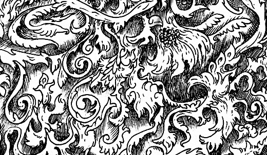
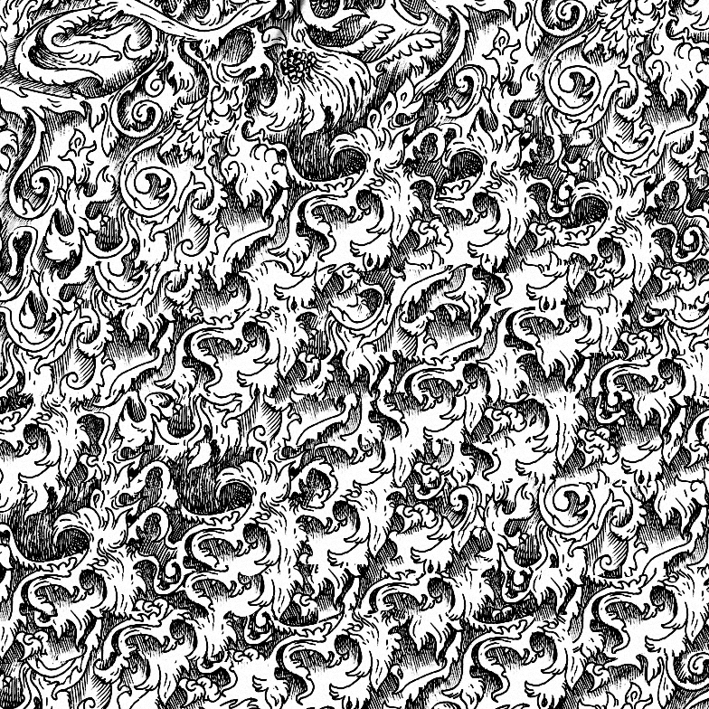

# ImageQuilt

A simple implementation of the Image Quilting algorithm from Efros & Freeman paper in C++

It is currently extremely unoptimized and naive implementation.

Sample input:

Synthesis output:

